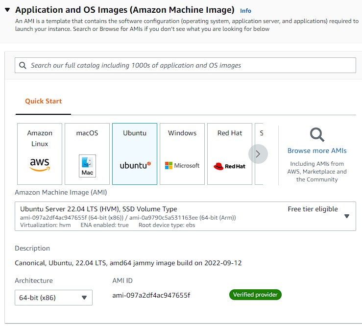
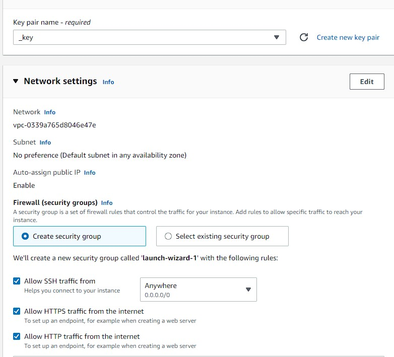
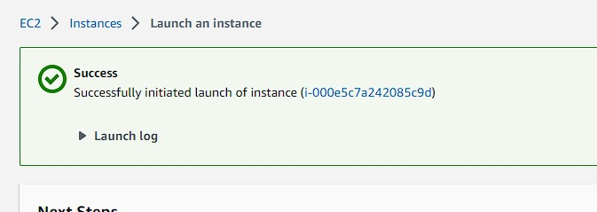
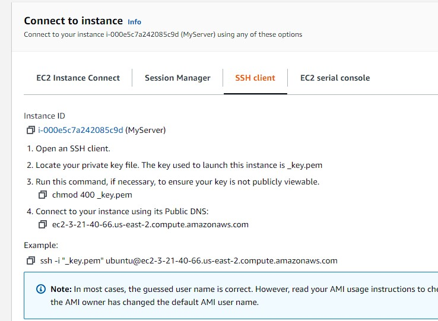
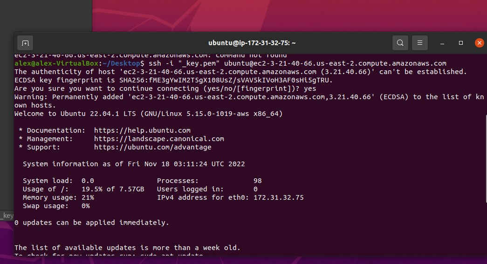
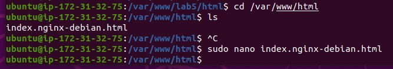
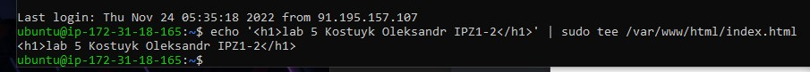
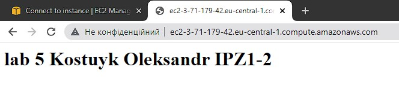

# Лабораторна робота №5. Деплой проекту на AWS EC2

## План:
 1. Зареєструватись на AWS.
 2. Створити інстанс EC2.
 3. Задеплоїти проект (може бути html сторінка) і скинути посилання в звіт для можливості перегляду.

---
Виконав студент ІІІ курсу

Напрям ІПЗ, група 1.2

Костюк Олександр Анатолійович

---

### 1. Зареєструватись на AWS.

У мене вже був акаунт на AWS, тому перше завдання було виконаним

### 2. Створити інстанс EC2.

вибираю операційну систему


Далі згенерував SSH ключ для доступу, також можна було вибрати для підключення вже існуючі ключі

Переходимо до налаштувань мережі,де даємо доступ через SSH та дозволяємо HTTP і HTTPS трафік



Натискаємо на Launch Instance і переходимо у вкладку Instances



Бачимо, що наш інстанс створено

Після цього вибираємо його(просто клік мишею) та тиснемо зверху на кнопку Connect



### 3. Задеплоїти проект (може бути html сторінка) і скинути посилання в звіт для можливості перегляду.

Входимо у термінал ОС, яку ми встановили раніше



Тепер нам треба встановити сервер (nginx або apache).

Встановив за допомогою команд

```
sudo apt upgrade
sudo apt install apache2
sudo ufw allow in "Apache Full"
sudo systemctl restart apache2
```
Змінив вміст html файлу, отримавши доступ до терміналу інстансу.



Далі я заповнив свій html файл



Перейшовши за адресою створеного ресурсу http://3.21.40.66/ отримав наступний результат:




[Лінк на сайт](http://3.21.40.66/)