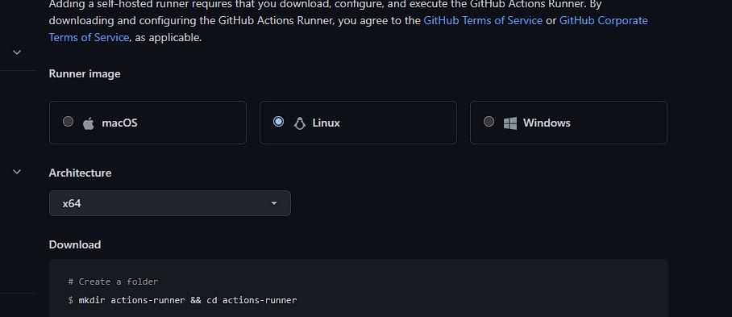
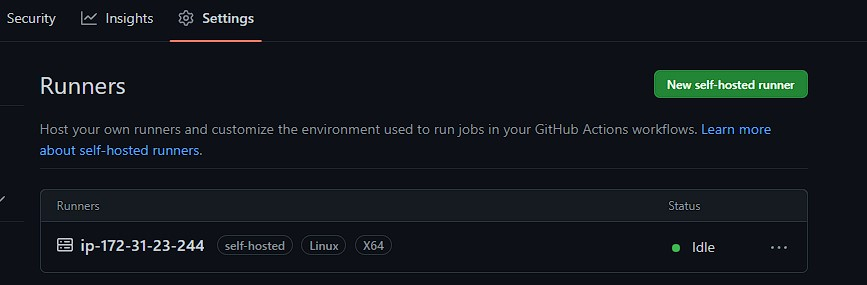
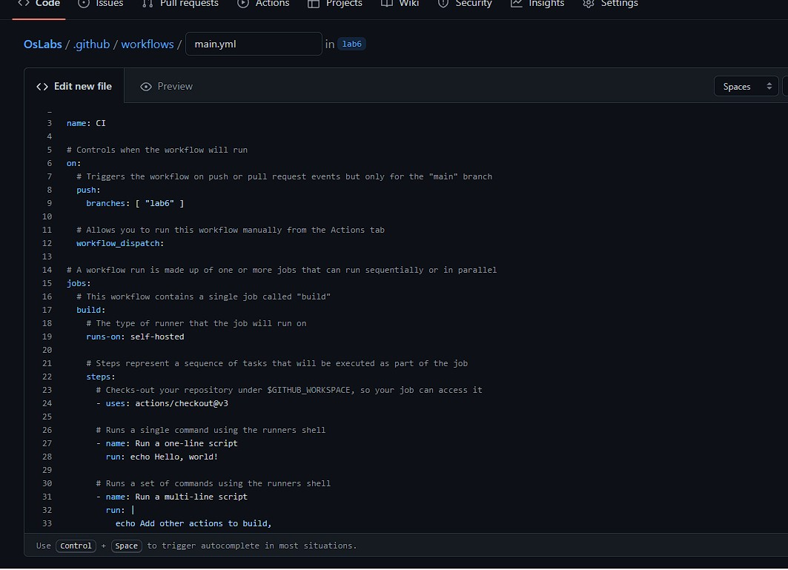
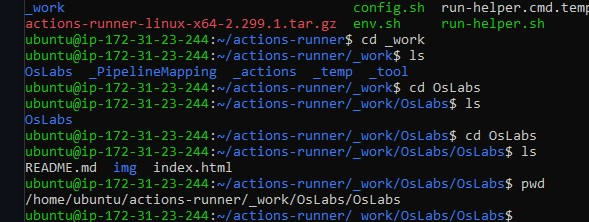
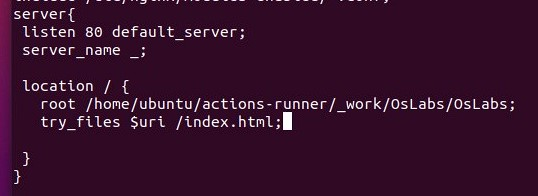
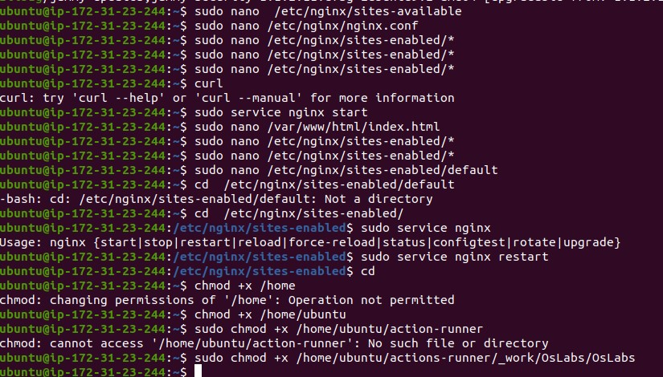

# Лабораторна робота №4. Create terraform scenario for provisioning infrastructure on GCP (or AWS) cloud

## План:
 1. Create one instance (image: ubuntu 20.04)
 2. Allow HTTP/HTTPS traffic on a NIC
 3. Provision one SSH public key for created instance
 4. Install Web Server (Apache HTTP Server / NGINX HTTP Server) via bash scenario

---
Виконав студент ІІІ курсу

Напрям ІПЗ, група 1.2

Костюк Олександр Анатолійович

---

### 1. Create one instance (image: ubuntu 20.04)

зареєструвався на AWS, та створив користувача. Після чого отримав для цього користувача access_key i secret_key для того, щоб у подальшому використати їх у файлі config.tf

Далі я створив файл config.tf для прописування конфігурації образу убунти, щоб за допомогою Тераформу розмістити її на AWS.

Потім виконав команди terraform init(деплой інстансу на AWS), terraform plan(які зміни відбудуться після аплаю файлу), terraform apply(власне розміщення на AWS):

### 2. Allow HTTP/HTTPS traffic on a NIC

Прописую відповідні дозволи у файлі, також прописую security group безпосередньо для цього інстансу. 

Вигляд доданої security group y AWS:

результат:

### 3. Provision one SSH public key for created instance

Спочатку згенерую приватний та паблік ssh-ключі за допомогою наступної команди:

Додаю наступне у config.tf:

Далі потрібно додати ключ у resource:

ingress блок, що дозволяє вхідному трафіку SSH отримати доступ до VPS через протокол SSH з віддаленої машини

### 4. Install Web Server (Apache HTTP Server / NGINX HTTP Server) via bash scenario

Bash скрипт установки та запуску apache2

Додання скрипту до instance за допомогою user_data

