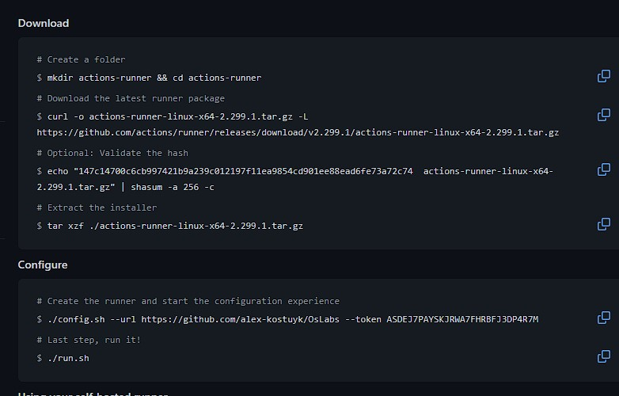

# Лабораторна робота №6. Використання GitHub Actions.

## План:
 1. Ознайомитись із поняттями CI/CD та GitHub Actions.
 2. Задеплоїти проект на EC2 або VPS(за наявності) за допомогою GitHub Actions.
 3. Ознайомитись із github pipelines та використати їх для реалізації CI/CD.

---
Виконав студент ІІІ курсу

Напрям ІПЗ, група 1.2

Костюк Олександр Анатолійович

---

### 1. Ознайомитись із поняттями CI/CD та GitHub Actions.

Безперервна інтеграція (CI/CD) — це практика програмного забезпечення, яка вимагає частого committing code в спільному репозиторії. Частіша committing code швидше виявляє помилки та зменшує обсяг коду, який розробнику потрібно налагодити під час пошуку джерела помилки. Часті оновлення коду також спрощують об’єднання змін від різних членів команди розробників програмного забезпечення. Це чудово для розробників, які можуть витрачати більше часу на написання коду та менше часу на налагодження помилок або вирішення конфліктів злиття.

Коли ви фіксуєте код у своєму репозиторії, ви можете постійно створювати та тестувати код, щоб переконатися, що committing не створює помилок. Ваші тести можуть включати лінтери коду (які перевіряють форматування стилю), перевірки безпеки, покриття коду, функціональні тести та інші спеціальні перевірки. Для створення та тестування коду потрібен сервер. Ви можете створювати та тестувати оновлення локально, перш ніж надсилати код у сховище, або ви можете використовувати сервер CI, який перевіряє наявність нових комітів коду в сховищі. CI за допомогою GitHub Actions пропонує робочі процеси, які можуть створювати код у вашому сховищі та запускати ваші тести. Робочі цикли можна запускати на віртуальних машинах, розміщених на GitHub, або на машинах, які ви самі хостите.

Ви можете налаштувати свій робочий процес CI на запуск, коли відбувається подія GitHub (наприклад, коли новий код надсилається у ваше сховище), за встановленим розкладом або коли відбувається зовнішня подія за допомогою веб-хуку відправки сховища. GitHub запускає ваші тести CI та надає результати кожного тесту в запиті на отримання, щоб ви могли побачити, чи зміна у вашій гілці викликає помилку. Коли всі тести CI в робочому процесі пройдено, внесені вами зміни готові до перегляду членом команди або об’єднання. Якщо тест фейлиться, то ви можете легко перреглянути та вирішити помилку.Коли ви налаштовуєте CI у своєму репозиторії, GitHub аналізує код у вашому сховищі та рекомендує робочі процеси CI на основі мови та фреймворку у вашому сховищі. Наприклад, якщо ви використовуєте Node.js, GitHub запропонує початковий робочий процес, який інсталює ваші пакети Node.js і запускає ваші тести. Ви можете скористатися початковим робочим процесом CI, запропонованим GitHub, налаштувати запропонований початковий робочий процес або створити власний власний файл робочого процесу для запуску тестів CI.Окрім допомоги в налаштуванні робочих процесів CI для вашого проекту, ви можете використовувати GitHub Actions для створення робочих процесів протягом усього життєвого циклу розробки програмного забезпечення. Наприклад, ви можете використовувати дії для розгортання, упаковки або випуску свого проекту.

GitHub Actions — це платформа безперервної інтеграції та безперервної доставки (CI/CD), яка дозволяє вам автоматизувати збірку, тестування та розгортання. Ви можете створювати робочі процеси, які створюють і тестують кожен запит на отримання до вашого сховища, або розгортати об’єднані запити на отримання в робочому середовищі.

GitHub Actions виходить за рамки просто DevOps і дозволяє запускати робочі процеси, коли у вашому сховищі відбуваються інші події. Наприклад, ви можете запустити робочий процес, щоб автоматично додавати відповідні мітки щоразу, коли хтось створює нову проблему у вашому сховищі.

### 2. Задеплоїти проект на EC2 або VPS(за наявності) за допомогою GitHub Actions.

Спочатку я створив інстанс EC2 на AWS з такими ж налаштуванням як у лабораторній №5. Потім я створив файл index.html та закомітив його у гілку lab6 у репозиторій OsLabs на GitHub.

Далі у репозиторії зайшов у Settings -> Actions -> Runners

Створюю self-host runner для представлення Лінукс(оскільки я при створенні інстансу на AWS обрав ОС Лінукс):

Вхід у інстанс за допомогою згенерованого при створенні інстансу SSH-ключа:

Виконую наступні команди з Settings -> Actions -> Runners свого репозиторію у командному рядку:

Виконую налаштування ранеру(залишаю все за замовчуванням) та активую його:

Там робимо налаштування ранера, я залишив дефолтні

Після цих операцій оновлюємо сторінку браузера та бачимо створений і активний ранер

Далі нам потрібно встановити nginx на свій інстанс, дати дозвіл х+ усім папкам в шляху до нашого файлу і прописати конфіг сервера щоб запустити сторінку

Ось результат:

### 3. Ознайомитись із github pipelines та використати їх для реалізації CI/CD.

